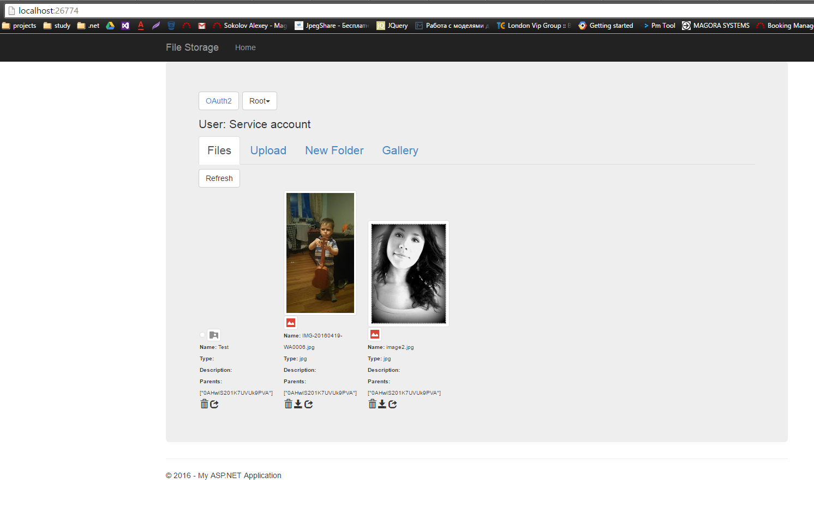
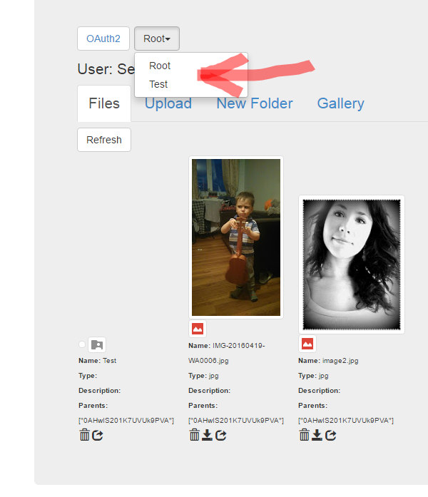
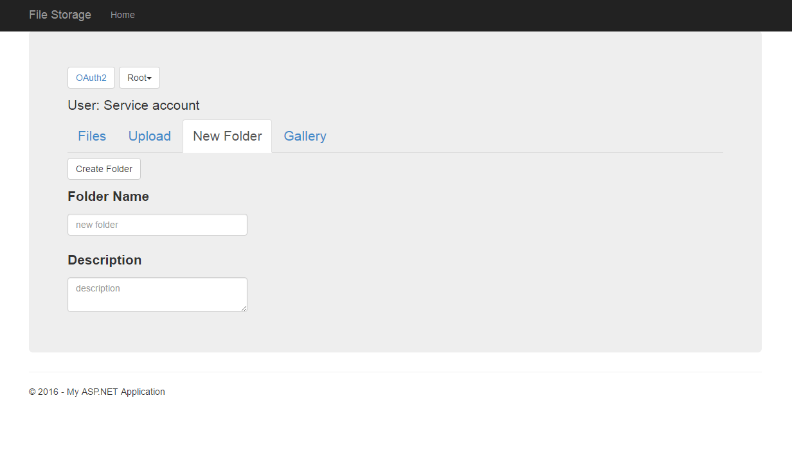
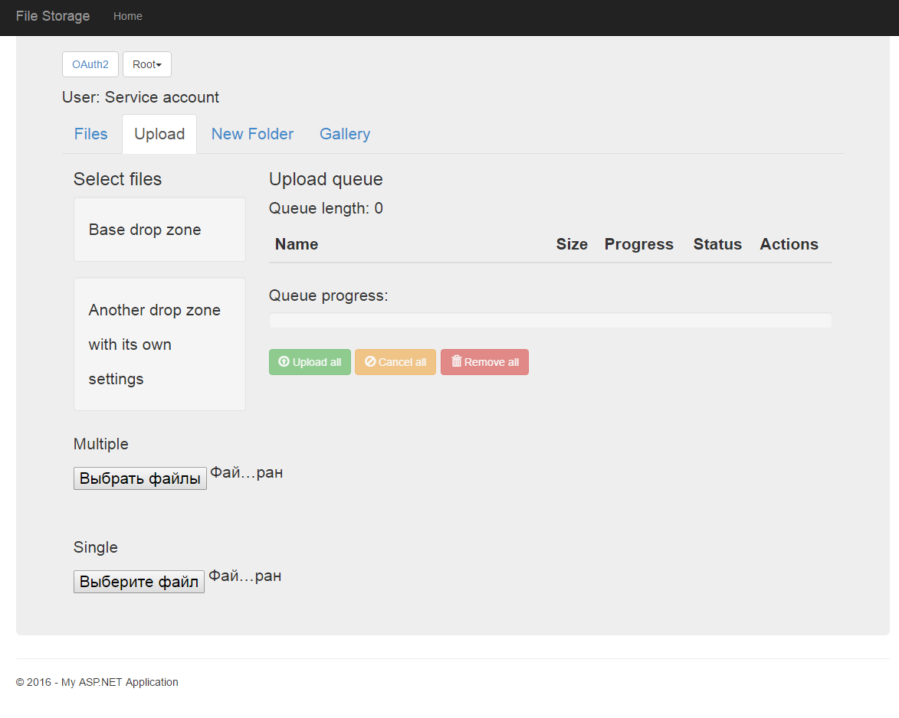
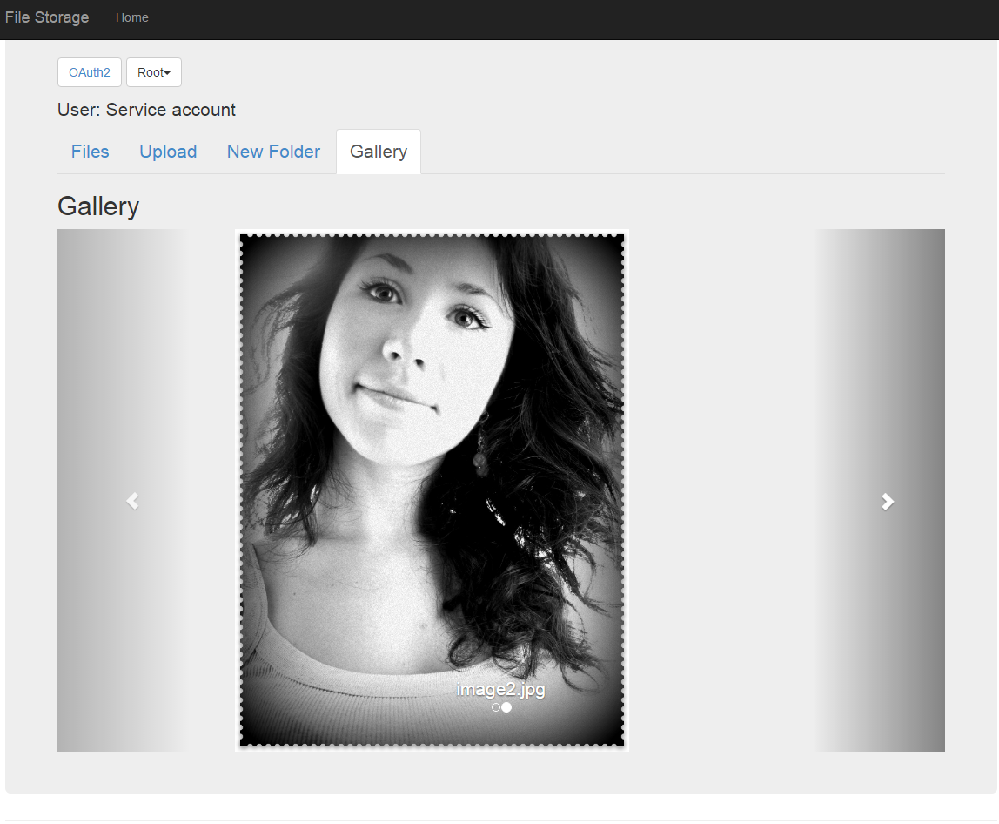

Google drive api usage
===================

***description***
Simple web apllication to wrap & test net google drive client <i class="icon-provider-gdrive"></i> ***Google Drive***.

----------
Table of Contents
=================

  * [Quick start](#Quick-start)
  * [Authenticate](#Authenticate)
  * [Api](#Api)
  * [Static public interfaces](#Static-public-interfaces)
	  * [Addicted Models](##Addicted-Models)
  * [Advance Search](#Advance-Search)
  * [Testing UI](#Testing-UI)
  * [Usefull links](#Usefull-links)


# Quick start

Main wrapper is static class GDriveApi.Services.GoogleDriveService.

To authorize transfer path to your p12 key in method Authenticate
```
var keyPath = System.Web.Hosting.HostingEnvironment.MapPath(authKeyPath);
GoogleDriveService.Authenticate(keyPath);
```
After that you can use all api methods:

Get all root files:
```
 var files = GoogleDriveService.GetRootFiles();
```

Get files in folder:
```
 var folders = GoogleDriveService.GetFolders(folderId);
```

Get folders:
```
 var files = GoogleDriveService.GetFiles(folderId);
```

Create folder:

```
 GoogleDriveService.CreateFolder(new CreateFolderRequest {
	 folderName = newFolderName,
	 folderDesc = newDescription,
	 parentId = parentFolderId
 });
```
Upload file:
```
 GoogleDriveService.UploadSharedFile(stream, filename);
```

# Authenticate
First, you must **authenticate** via service account with p12 key.
	
Now user created under owner sokolov@magora.systems.
	
Key places in root of [web project](https://github.com/SokolovAlex/google_drive_net/blob/master/GDriveApp/GDriveApp/FileStorage-6817de257573.p12) 
To create new service account [follow manual.](https://developers.google.com/identity/protocols/OAuth2ServiceAccount#creatinganaccount)

When you create service account you should authnticate with this key.
```
var keyPath = System.Web.Hosting.HostingEnvironment.MapPath(authKeyPath);
GoogleDriveService.Authenticate(keyPath);
```

# Api
There are realized some web api methods:

| Url| Type| Description  |
| ------------- |:-------------:|:-----|
| api/files      | GET | Get root files |
| api/files/{parent}      | GET |   Get files in determined folder |
| api/upload/save | POST | Save file on upload folder |
| api/upload| POST  |  Save file on google disk and share it to anyone|
| api/file/{id} | DELETE | Delete file from Google disk |
| api/share/{id} | POST | Share file to anyone |
| api/folder | POST | Get root folders only |
| api/folder/{parent} | GET | Get root folders only in determinated folder |
| api/folder | GET | Create new folder |


# Static public interfaces

Public methods in GDriveApi.Services.GoogleDriveService: 

| Name| Parameters| Return| Description  |
|:------|:------:|:-----:|:-------------------:|
| Authenticate | string(path to key) | void | authorize service account & create service with p12 sertificate
| GetFolders      | - |  IEnumerable[FileModel]  | Get all root folders 
| GetFolders | string | IEnumerable[FileModel] |  Get all folders parent folder
| CreateFolder| {folderName[string], folderDesc[string], parentId[string]} | FileModel | Get files in determined folder |
| RetainFolders | IEnumerable[FileModel] | IEnumerable[FileModel] |filter files with  not folder mime type |
| GetRootFiles | - |  IEnumerable[FileModel] | Get all files in root folder |
| GetFiles | string | IEnumerable[FileModel]  |Get all files parent folder |
| GetFilesAsync | SearchFilter |  Task[FileList] | Get all files parent folder async |
| GetFiles | SearchFilter | IEnumerable[FileModel] | Create new folder |
| MemorySelectedFolder| string| void | save selected folder in static field to work with after |
| UploadSharedFile| stream, string| void | upload file to google drive from stream and set permissions for anyone  |
| UploadSharedFile| byte[], string| void | upload file to google drive from bytes and set permissions for anyone |
| UploadFile| stream, string| void | upload file to google drive from stream |
| UploadFile| byte[], string | void | upload file to google drive from bytes|
| Share| string | void | set permissions to file for anyone |
| ShareAsync| string  | Task | set permissions to file for anyone async|
| DeleteFile| string | void | delete file |
| DeleteFileAsync| string  | Task | delete file async|

## Addicted Models
| Name| Fields| Description 
| ------------- |:-------------:| -----:|
| FileModel| Id Name IconLink FileExtension Thumbnail Description WebContentLink Parents MimeType | Common fileds of google drive entities |
| SearchFilter | PageSize[20] Query | Search filter model for advance filtering |


# <i class="icon-folder-open"></i> Advance Search
-------------
To advance serch files you can user google drive query field. see format [here](https://developers.google.com/drive/v3/web/search-parameters#value_types)

Example: 
```
GetFiles(new SearchFilter
    {
        Query = "modifiedTime > '2012-06-04T12:00:00' and (mimeType contains 'image/' or mimeType contains 'video/')"
    });
```
# Testing UI
-------------

For test api was created angular ui application.

On first tab there are displays all files and folders which places in folder that selected above


	There are displayed file name,  thumbnail,  icon,  file extension, and parents ids.
	Here you can download file, share file, and delete file by pressing proper action near.
	When you change selected folders, files on changet to files in selected folders, also list of folders refreshs too to folders with selected parent.
	When you create new folders or upload files, it will be added to selected folder.



Also on last tab created gallery with whole size images stored in google grive in selected folders.


# Technologies
-------------
- webApi
- [Google.Apis.Drive.v3](https://www.nuget.org/packages/Google.Apis.Drive.v3/)
- [angularjs](https://angularjs.org/)

# Usefull links
- [detailed manual for version 2](http://www.daimto.com/google-drive-api-c-download/)  
- [google sandbox for version 3](https://developers.google.com/drive/v3/reference/)
- [original code for Google.Apis.Drive.v3](https://github.com/google/google-api-dotnet-client/tree/master/Src/Generated/Google.Apis.Drive.v3)
- [angular upload plugin](https://github.com/nervgh/angular-file-upload)

